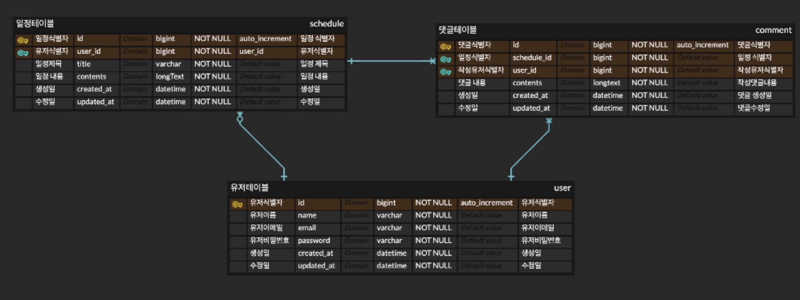
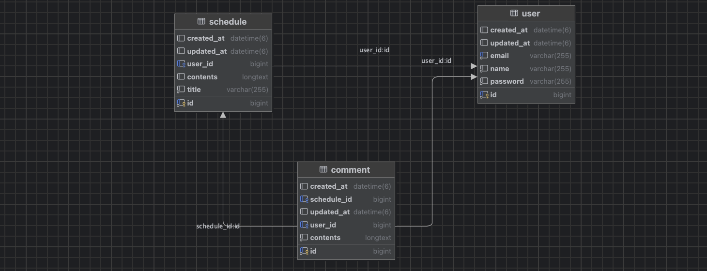

## 프로젝트 개요

___

### 프로젝트 : 일정관리 API 만들기 - develop

### 프로젝트 목적

- Spring MVC 구조 이해
- JPA를 활용한 CRUD
- Cookie/Session 과 ServletFilter를 활용한 인증/인가 구현
- valid, validated 어노테이션으로 검증 구현

### 기술 스택

- Java 17
- Spring MVC 3.3.6
- JPA
- MySQL Community Server 9.2.0

____

### 기능 요구사항

#### 일정관련

- 일정 생성
- 일정 단건 조회
- 일정 전체 조회
- 일정 업데이트
- 일정 삭제

#### 유저관련

- 유저 생성
- 유저 조회
- 유저 업데이트
- 유저 삭제

___

### ERD & Diagrams

### API

# API 명세서
[swagger-docs](https://mxcoogi.github.io/schedule-swagger-ui/)